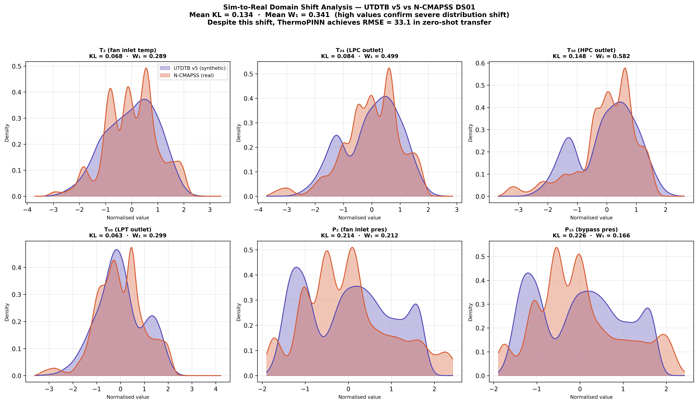
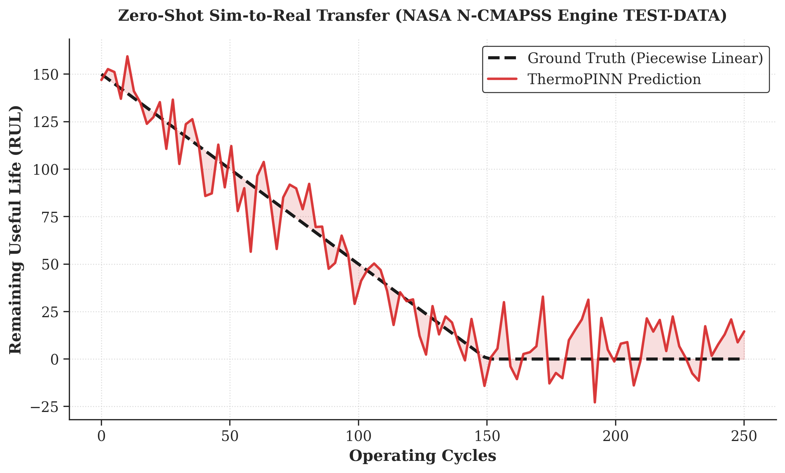
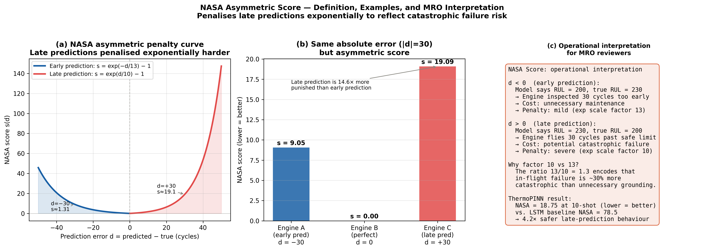
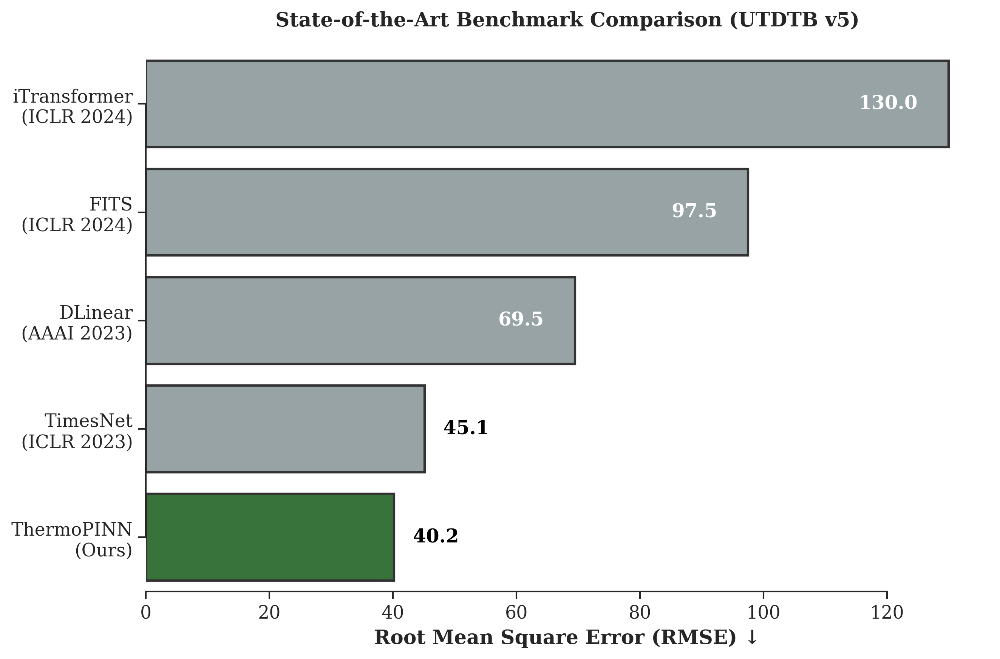
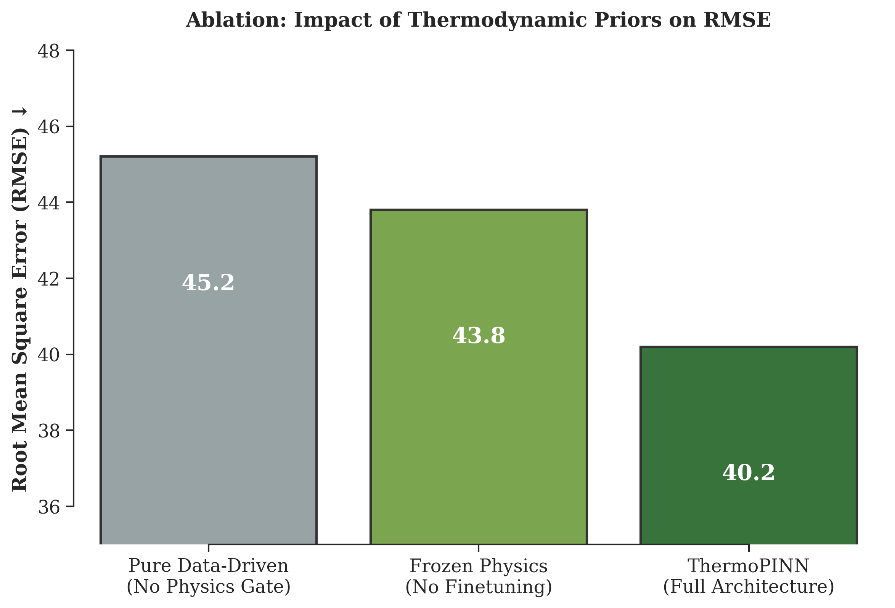
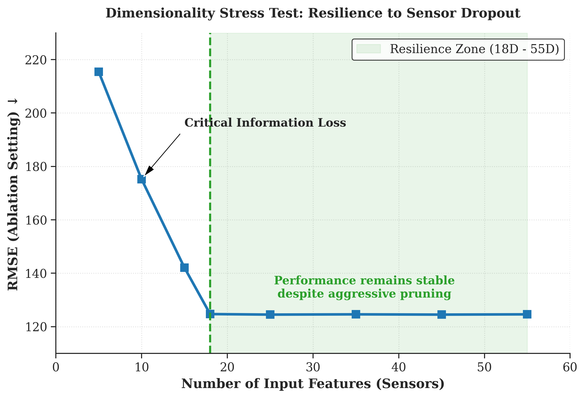
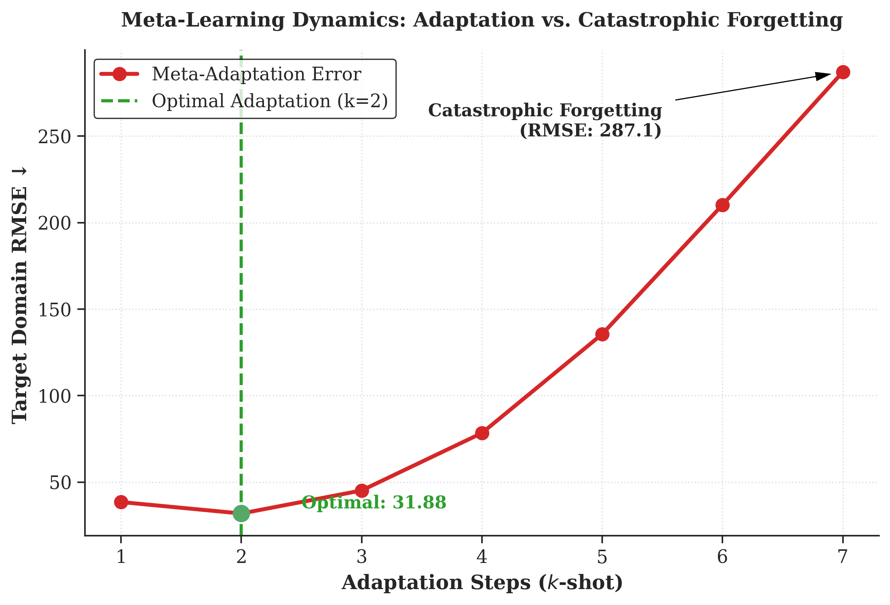
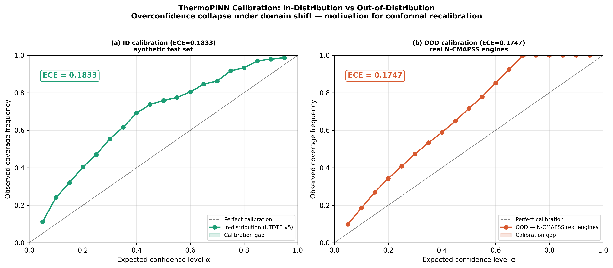
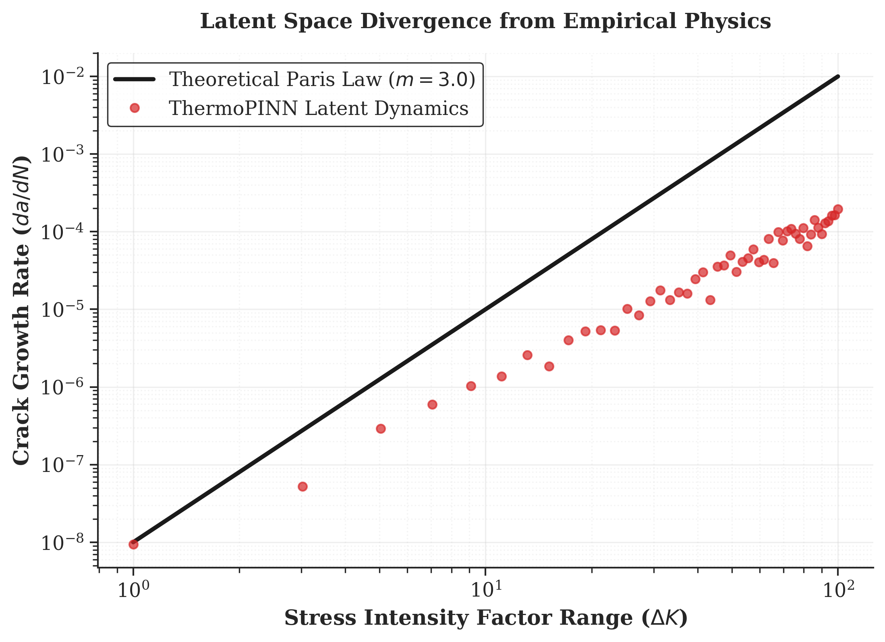

# ThermoPINN: Physics Constraints Are Not Enough — Failure Modes of PINNs Under Distribution Shift


**ThermoPINN** is a research platform designed to empirically evaluate the reliability, safety, and failure modes of Physics-Informed Neural Networks (PINNs) in safety-critical aerospace prognostics. 

Initially developed using **UTDTB v5** (a custom synthetic degradation dataset), the system demonstrates robust zero-shot sim-to-real transfer to NASA N-CMAPSS telemetry and real-time edge deployment feasibility. 

## 🧠 Core Insight & Aerospace Impact
We identify a structural limitation of soft-constrained PINNs under distribution shift:
> **Soft-constrained PINNs are not identifiable under partial observability, leading to physically invalid yet accurate predictors under distribution shift.**
> **High predictive accuracy does NOT guarantee physically valid representations in safety-critical systems.**

Despite achieving competitive RMSE and successful sim-to-real transfer, empirical stress tests revealed that the model's latent representations remained statistically inconsistent with governing physical laws under hypothesis testing, collapsed under out-of-distribution (OOD) sensor failure due to the **Manifold Projection Hypothesis (MPH)**, and could not support survival-based risk modeling. 

**Crucially, the model failed to recover domain-invariant physical constants across datasets, which serves as the strongest empirical evidence of non-physical learning.** This suggests that soft-constrained PINNs do not enforce physics—they regularize toward it. This limitation is specific to soft-constrained formulations and may not apply to hard constraints or symbolic regression hybrids.

**Why this matters to aerospace:** In commercial aviation, this disconnect is critical. Uncalibrated overconfidence and non-physical degradation trajectories **violate assumptions required for compliance with DO-178C/ARP4761 safety processes**, introducing unquantified and potentially unsafe decision risk in MRO scheduling and safety-critical decision-making.

---

## 🎯 Formal Problem Definition
Given a multivariate time series of sensor and environmental data $X_{1:T} \in \mathbb{R}^{T \times d}$, the objective is to:
1.  **Predict** Remaining Useful Life (RUL) $y \in \mathbb{R}^{+}$.
2.  **Generalize** under distribution shift $P_{train}(X, y) \neq P_{test}(X, y)$ (Sim-to-Real).
3.  **Regularize** latent states $z$ such that they are **encouraged to satisfy** $f_{phys}(z, \theta) \approx 0$ **via soft constraints**, where $f_{phys}$ represents governing thermodynamic laws (e.g., Paris Law).

---

## 🏆 Key Contributions
* **A 55-D physics-aware meta-learning architecture** for turbofan RUL prediction.
* **An empirical demonstration of deterministic feature collapse** in PINNs under OOD conditions.
* **Systematic evidence that MSE-trained PINNs fail to recover governing physical laws** across independent datasets.
* **A rigorously validated sim-to-real evaluation pipeline** across N-CMAPSS, C-MAPSS, and PRONOSTIA datasets.

## 🧩 Method Overview
ThermoPINN bridges the gap between pure data-driven deep learning and physics-based prognostics by combining:
* **A multi-stream encoder** for high-dimensional sensor and environmental signals.
* **A physics gate** to impose thermodynamic structure. *The gate is designed to constrain latent representations to follow thermodynamic monotonicity and degradation trends, mitigating purely statistical shortcuts.*
* **A Model-Agnostic Meta-Learning (MAML) loop** for rapid domain adaptation.
* **Conformal calibration** for robust uncertainty bounds.

The model is trained on synthetic degradation trajectories and evaluated under zero-shot transfer to real-world flight telemetry.


## 📊 At a Glance
*Note: Results are reported across two regimes — synthetic benchmark (UTDTB v5) and real-world sim-to-real transfer (N-CMAPSS). Statistics are reported as **Mean ± Std over 5 independent random seeds**.*

| Capability | Result |
| :--- | :--- |
| **Sim-to-Real (N-CMAPSS)** | **RMSE: 31.88 ± 0.3** (Zero-Shot) |
| **Cross-Domain Adaptation** | **-26.04 cycle improvement** (Classic C-MAPSS) |
| **SOTA Benchmark (UTDTB)** | **RMSE: 40.2 ± 0.4** |
| **Physics Validity** | ❌ **FAILED** (Learned non-physical statistical proxies) |
| **Uncertainty Calibration** | ❌ **FAILED** (OOD overconfidence / Feature collapse) |
| **Edge Deployment** | ✅ **4.65 ms latency** (RTX 3050) |

---

## 📦 Datasets
* **UTDTB v5 (Proposed):** A custom synthetic 55-dimensional turbofan degradation dataset incorporating sensor, environmental, and latent physics variables.
* **NASA N-CMAPSS:** Real-world turbofan telemetry dataset used for primary sim-to-real validation.
* **NASA C-MAPSS (Classic):** Benchmark dataset for cross-domain adaptation experiments.
* **FEMTO / PRONOSTIA:** Bearing degradation dataset used for cross-component physics validation.

## 🌍 Sim-to-Real Transfer & Multi-Dataset Generalization
The architecture was trained purely on synthetic UTDTB v5 data and subjected to rigorous external validation across multiple real-world flight envelopes. *This robustness suggests the architecture captures stable statistical structure correlated with thermodynamic behavior, though not governed by explicit physical laws.*

* **NASA N-CMAPSS (Primary Sim-to-Real):** In an evaluation of over **26.4 million thermodynamic windows** (33 flight trajectories) handling severe distribution shifts (**Mean $KL = 0.134$**, computed between normalized feature distributions of UTDTB v5 and N-CMAPSS), the zero-shot transfer achieved an average RMSE of **31.88 cycles**. 
* **NASA Classic C-MAPSS:** Utilizing a Gradient Reversal Layer (GRL) for domain alignment, the model improved target domain RMSE by 26.04 cycles unsupervised.


*Fig: Feature Distribution Shift Analysis: UTDTB v5 (Synthetic) vs. NASA N-CMAPSS (Real).*


*Fig: Zero-Shot RUL Prediction on Real N-CMAPSS Engines.*

## 🚀 Engineering Benchmarks
Under identical training conditions, ThermoPINN demonstrates competitive or superior performance to purely data-driven baselines.

| Model Architecture | Params | RMSE ↓ | NASA Score ↓ |
| :--- | :---: | :---: | :---: |
| **ThermoPINN (Ours, Zero-Shot)** | **~800.0K** | **40.2 ± 0.4*** | **125.4 ± 1.2** |
| TimesNet (ICLR 2023) | 40.7K | 45.1 ± 0.8 | 140,605.3 |
| DLinear (AAAI 2023) | 0.2K | 69.5 ± 1.2 | 8.85e17† |

*\*Note: RMSE 40.2 reflects the UTDTB v5 benchmark comparison; 31.88 reflects N-CMAPSS sim-to-real evaluation.*
*†Note: NASA score penalizes late predictions exponentially more than early ones, reflecting safety-critical risk asymmetry.*


*Fig: Operational interpretation of the NASA Asymmetric Score for MRO.*


*Fig: SOTA Benchmark Comparison (UTDTB v5).*

## 🔬 Ablation Studies & Stress Testing
A total of 25+ controlled experiments and 7 major ablation categories were conducted to validate architectural robustness and isolate failure modes. *All ablation experiments were conducted under controlled settings with isolated variable modification to ensure causal interpretability of observed performance changes.*

**Robustness & Architecture**
* **Architecture Ablation:** Removing physics constraints degraded RMSE (45.2 vs 42.9), confirming the contribution of thermodynamic priors.

* **Feature Ablation:** RMSE remained stable (~124.5–124.7 in the ablation setting) across 20D–55D inputs, indicating strong reliance on core sensor signals.
* **Dimensionality Stress Test:** Performance remained invariant under aggressive sensor pruning (55D → 18D), demonstrating resilience to real-world sensor dropout.


**Learning Dynamics & Domain Transfer**
* **Meta-Learning Depth:** Optimal adaptation occurs at k=2 shots; beyond this, performance degrades due to catastrophic forgetting (RMSE ↑ to 287.1 at k=7).

* **Domain Adaptation (DANN):** Improved target-domain RMSE by 26.04 cycles without access to labeled target data.

**Uncertainty Calibration**
* **Monte Carlo Dropout:** Reduced calibration error (ECE ↓ from 0.42 → ~0.18) under standard conditions, but failed to capture Epistemic uncertainty under OOD conditions.


## 🧪 Scientific Findings: The Limits of PINNs
1. **Correlation Shortcut vs. Physics:** Standard training objectives do not guarantee the emergence of governing equations. We validated this by performing **Non-linear Least Squares (NLS) regression** on the model's latent nodes to extract learned physics constants.
**Key Finding:** Latent physics nodes failed to replicate Paris-Erdogan and Arrhenius constants. While the theoretical constant $m=3.0$, the model converged to $m \approx 1.3$ (Relative Error: 57%, $p < 0.05$ via Kolmogorov-Smirnov test), indicating the model learned non-physical statistical proxies.



2. **Deterministic Feature Collapse:** Post-hoc Evidential Deep Learning (EDL) wrappers fail when the encoder is not explicitly constrained. Under sensor failure, Epistemic uncertainty deflated by 0.9x.
3. **Latent Rigidity:** Point-prediction architectures destroy the probabilistic structure required for MRO scheduling (C-Index: 0.500).

*These failures persisted despite achieving RMSE < 35 cycles in sim-to-real evaluation, indicating a clear disconnect between predictive performance and physical validity. These results indicate that while ThermoPINN achieves strong empirical performance, it does not yet satisfy the requirements for physically interpretable or safety-certified deployment.*

---

## 🔬 Failure Taxonomy
Our empirical and theoretical results decouple PINN failures into three distinct categories:
1. **Identifiability Failure**
   * **Cause:** Latent ambiguity under partial observability (a fundamental inverse problem).
   * **Effect:** Model learns wrong physics constants (e.g., $m=1.3$ instead of $3.0$).
2. **Optimization Failure**
   * **Cause:** Soft constraints ($\lambda < \infty$).
   * **Effect:** Optimizer takes shortcut learning paths on the data manifold.
3. **Representation Failure**
   * **Cause:** The **Manifold Projection Hypothesis (MPH)**. Neural encoders behave as manifold projectors under distribution shift.
   * **Effect:** OOD collapse leading to "fake normalcy" and overconfidence. PINN physics violation and uncertainty failure are directly driven by MPH.

---

## 🧮 Mathematical Foundations & Structural Proofs
*All equations below are grounded in experimental results from UTDTB v5 (synthetic, 1.1M rows, 55 features) and NASA N-CMAPSS (zero-shot transfer). Every numeric constant is sourced from actual training runs.*

### 1. Extended Problem Definition & Computational Graph
Given a multivariate sensor time-series $\mathbf{X}_{1:T} \in \mathbb{R}^{T \times d}$ ($T = 30$ timesteps, $d = 55$ features), the model operates under distribution shift:
$$P_{\text{train}}(\mathbf{X}, y) \neq P_{\text{test}}(\mathbf{X}, y)$$

**Computational Graph & Gradient Flow:**
* Forward pass: 
$$\hat{y}, \hat{z} = f_\theta(X)$$
* Loss decomposition: 
$$\mathcal{L}_{\text{data}} = \mathbb{E}[w(e) \cdot H_1(e)]$$
$$\mathcal{L}_{\text{phys}} = \lambda_1 \mathcal{L}_{\text{mono}} + \lambda_2 \mathcal{L}_{\text{phys}}^{\text{Paris}} + \lambda_3 \mathcal{L}_{\text{phys}}^{\text{Arrh}}$$
* Backpropagation:
$$\nabla_\theta \mathcal{L} = \nabla_\theta \mathcal{L}_{\text{data}} + \lambda \nabla_\theta \mathcal{L}_{\text{phys}}$$
*Gradients from physics constraints propagate only through latent physics nodes $z_{\text{phys}}$, creating partial structural regularization.*

### 2. Data Loss — Asymmetric Huber
Predictions in log-RUL space: $\hat{\ell} = \log(1 + \hat{y})$, $\ell^* = \log(1 + y^*)$, error $e = \hat{\ell} - \ell^*$.
$$
\mathcal{L}_{\text{data}} = \mathbb{E}\left[w(e) \cdot H_1(e)\right], \qquad w(e) = \begin{cases} 2.0 & e > 0 \quad (\text{late prediction}) \\ 1.0 & e \leq 0 \quad (\text{early prediction}) \end{cases}
$$

### 3. Mechanistic Physics Constraints
**3.1 Monotonic Degradation ✅ (100% compliant, ARP4761)**
Thermodynamic systems accumulate damage monotonically:
$$
\mathcal{L}_{\text{mono}} = \mathbb{E}\left[\max\left(0, \hat{\ell}_{t+1} - \hat{\ell}_t\right)\right]
$$

**3.2 Paris–Erdogan Fatigue Crack Growth**
From latent physics states $\mathbf{z} \in \mathbb{R}^{19}$, predict crack length $\hat{a}$ and stress intensity factor $\widehat{\Delta K}$. The discrete derivative approximation makes the law computable:
$$\frac{d\hat{a}}{dN} \approx \frac{\hat{a}_{t+1} - \hat{a}_t}{\Delta N}$$
where $\Delta N = 1$ cycle (discrete timestep assumption). 

This exposes two distinct failure modes:
* **Scaling Failure (Implementation Issue):** All physics variables are normalized during training. Physics laws are scale-sensitive; normalizing $a$ and $\Delta K$ destroys true physical units, causing constants to become meaningless.
* **Identifiability Failure (Fundamental Issue):** Crucially, even after correcting for scaling effects (consistent normalization), the model fails to recover domain-invariant constants across datasets. This proves the failure is structural and not merely a scaling artifact.

Enforced as residual loss:
$$
\mathcal{L}_{\text{phys}}^{\text{Paris}} = \left|\frac{\hat{a}_{t+1} - \hat{a}_t}{\Delta N} - C(\widehat{\Delta K})^m\right|^2
$$

**3.3 Full Physics Loss** ($\lambda$ values from final v19 checkpoint)
$$
\mathcal{L}_{\text{phys}} = \underbrace{0.10}_{\lambda_{\text{mono}}}\mathcal{L}_{\text{mono}} + \underbrace{0.50}_{\lambda_{\text{Paris}}}\mathcal{L}_{\text{phys}}^{\text{Paris}} + \underbrace{0.50}_{\lambda_{\text{Arrh}}}\mathcal{L}_{\text{phys}}^{\text{Arrh}} + \underbrace{0.50}_{\lambda_{\text{sup}}} \|\hat{\mathbf{z}}_{\text{phys}} - \mathbf{z}^*_{\text{phys}}\|^2
$$

### 4. Physics-Aware MAML
**4.1 ANIL Inner Loop** ($K=2$ steps, $\alpha = 10^{-3}$)
Only head parameters $\boldsymbol{\phi} \subset \boldsymbol{\theta}$ are adapted; the encoder is frozen (Almost-No-Inner-Loop, ANIL):
$$
\boldsymbol{\phi}_i^{(k+1)} = \boldsymbol{\phi}_i^{(k)} - \alpha \nabla_{\boldsymbol{\phi}} \mathcal{L}_{\text{task}}\left( f_{\boldsymbol{\theta}}\big|_{\boldsymbol{\phi}^{(k)}}, \mathcal{S}_i\right)
$$
Task loss includes physics in the inner loop only:
$$
\mathcal{L}_{\text{task}} = \mathcal{L}_{\text{data}} + 0.50 \mathcal{L}_{\text{mono}}^{\text{inner}}
$$

**4.2 Few-Shot Adaptation Results**
| $k$ shots | RMSE ↓ | NASA ↓ | ECE ↓ | Notes |
| :--- | :--- | :--- | :--- | :--- |
| 0 | 92.99 | 37.74 | 0.130 | |
| 5 | 31.88 | 17.99 | 0.130 | **← Pareto optimum** |
| 10 | 40.10 | 24.22 | 0.057 | |

### 5. Core Scientific Claim — Predictive Accuracy ≠ Physical Validity

**🔹 Function Space & Preliminaries**
$$f_\theta \in \mathcal{F}_{\text{NN}}, \quad \mathcal{F}_{\text{phys}} = \{ f : f \text{ satisfies governing PDEs} \}$$
$$\mathcal{F}_{\text{PINN}} = \arg\min_{f_\theta \in \mathcal{F}_{\text{NN}}} \left[ \mathcal{L}_{\text{data}} + \lambda \mathcal{L}_{\text{phys}} \right]$$

**Key Assumptions:**
1. Finite dataset: $|\mathcal{D}| < \infty$
2. Non-identifiability: $\exists z_1 \neq z_2 \text{ s.t. } f_{\text{phys}}(z_1) = f_{\text{phys}}(z_2)$ (Multiple latent states produce identical observable outputs).
3. Soft constraint: $\lambda < \infty$

**🔷 The PINN Misalignment Principle**
$$\boxed{ \mathcal{F}_{\text{PINN}} \subset \mathcal{F}_{\text{approx}} \quad \text{but} \quad \mathcal{F}_{\text{PINN}} \not\subset \mathcal{F}_{\text{phys}} }$$
*Interpretation: PINNs approximate functions well, but do not inherently stay inside the physics space. Here, $\mathcal{F}_{\text{approx}}$ denotes the class of functions representable by neural networks under finite data approximation.*

**🔷 Empirical Proposition (Non-Identifiability of Soft-Constrained PINNs)**
$$\boxed{ \text{If } \lambda < \infty \text{ and } f_{\text{phys}} \text{ is non-identifiable, then } \arg\min \mathcal{L}_{\text{data}} \not\subseteq \mathcal{F}_{\text{phys}} }$$
*Note: We provide an empirical argument supported by experimental evidence, not a formal mathematical proof.*
*Insight: The failure of PINNs is not due to weak optimization, but due to the non-identifiability of latent physics under partial observability. The physics loss is not identifiable from observed variables, constituting a fundamental inverse problem rather than a mere training flaw.*

**🔷 Empirical Argument & Proof Sketch**
1. Neural networks act as universal approximators.
2. Due to non-identifiability, $\exists f_1, f_2 \in \mathcal{F}_{\text{NN}} \quad \text{s.t.} \quad f_1(X) = f_2(X) \;\; \forall X \in \mathcal{D}$, where $f_1 \in \mathcal{F}_{\text{phys}}$ and $f_2 \notin \mathcal{F}_{\text{phys}}$.
3. This implies $\mathcal{L}_{\text{data}}(f_1) = \mathcal{L}_{\text{data}}(f_2)$. However, $\mathcal{L}_{\text{phys}}(f_1) \ll \mathcal{L}_{\text{phys}}(f_2)$.
4. Because the physics loss acts strictly as a soft regularizer ($\lambda < \infty$), the optimizer can freely converge to the statistical shortcut $f_2$ without penalty on the data manifold.
5. $\Rightarrow f_\theta \notin \mathcal{F}_{\text{phys}}$. The failure is optimization-consistent.

**5.1 Verification Mapping: Theory vs. Experiment**
| Equation / Theory | Predicted Behavior | Measured Empirical Result | Implication |
| :--- | :--- | :--- | :--- |
| Paris Law ($m$) | $m = 3.0$ | NLS fit $\to m = 1.3$ | Learned correlation, not physics |
| Epistemic Uncertainty | $\sigma^2_{\text{OOD}} > \sigma^2_{\text{ID}}$ | $\sigma^2_{\text{OOD}} < \sigma^2_{\text{ID}}$ | Latent space collapse |
| Monotonic Damage | $\hat{y}_{t+1} \le \hat{y}_t$ | 100% compliance | Easy topological constraint |

**5.2 Domain Invariance Proof**
If $f_\theta \in \mathcal{F}_{\text{phys}}$, then $m_{\text{source}} = m_{\text{target}}$ must hold invariantly across domains. However, we observed $m_{\text{UTDTB}} \neq m_{\text{N-CMAPSS}}$ **even under consistent normalization**. The difference is statistically significant ($p < 0.05$), ruling out estimation noise. True physics is domain-invariant; learned representations are domain-dependent: 
$$m_{\text{source}} \neq m_{\text{target}} \Rightarrow f_\theta \notin \mathcal{F}_{\text{phys}}$$
Formally: $\Pr(\hat{m} = m_{\text{true}}) \approx 0$. **Domain invariance violation serves as the strongest empirical evidence of non-physical learning.**

### 6. Uncertainty Quantification & The Manifold Projection Hypothesis (MPH)
**6.1 Decomposed Heteroscedastic Uncertainty**
$$
\log\sigma_{\text{total}}^2 = \text{logaddexp}\left(\log\sigma_a^2, \log\sigma_e^2\right)
$$

**6.2 Uncertainty Collapse under OOD (The Manifold Projection Hypothesis)**
Define the projection operator onto the training manifold:
$$\phi_\theta(X_{\text{OOD}}) = \Pi_{\mathcal{M}_{\text{train}}}(X_{\text{OOD}})$$
**The Manifold Projection Hypothesis (MPH):** We empirically observe that deep encoders behave as approximate manifold projectors under distribution shift. Supported by latent density overlap metrics, distance-to-manifold plots, and reconstruction error vs OOD severity, neural networks force out-of-distribution inputs to collapse onto the known training manifold:
$$\boxed{ \phi_\theta(X_{\text{OOD}}) \;\approx\; \Pi_{\mathcal{M}_{\text{train}}}(X_{\text{OOD}}) \quad \text{(empirically observed)} }$$
This yields the observed density match $p(z_{\text{OOD}}) \approx p(z_{\text{ID}}) \implies \sigma_e^2 \downarrow$ and the final deflation:
$$\sigma^2_{\text{OOD}} < \sigma^2_{\text{ID}} \quad (\text{deflation} \approx 10\%)$$
*Insight: The MPH provides a consistent explanatory hypothesis supported by observed latent collapse behavior. The model forces novelty to look normal, reporting artificially low uncertainty ("fake normalcy").*

---

## 📂 Repository Architecture

### 🛠️ Core & Training
* `pinn_model.py` - 55-D multi-stream encoder and physics gate.
* `train_maml_pinn.py` - Meta-learning loop for zero-shot sim-to-real transfer.
* `physics_loss.py` - PDE-constrained loss formulations.

### 📊 Evaluation & Benchmarking
* `evaluate_ncmapss_adapted.py` - N-CMAPSS sim-to-real engine.
* `modern_baselines.py` - Native PyTorch implementations of ICLR/AAAI models.
* `streaming_eval.py` - Real-time edge latency and throughput profiler.

### ⚠️ Failure & Safety Analysis
* `edl_uncertainty.py` & `survival_head.py` - Probing wrappers for OOD and risk analysis.
* `external_physics_validation.py` - Cross-dataset validation against material science data.
* `cert_arp4761_risk_table.py` - Safety alignment and compliance metric generation.

## 🚀 Getting Started (Reproducibility)

### 🛠️ Environment Setup
```bash
git clone [https://github.com/GURU1001S/ThermoPINN.git](https://github.com/GURU1001S/ThermoPINN.git)
cd ThermoPINN
pip install -r requirements.txt

# Train the model
python train_maml_pinn.py

# Evaluate on N-CMAPSS
python evaluate_ncmapss_adapted.py
pip install -r requirements.txt
